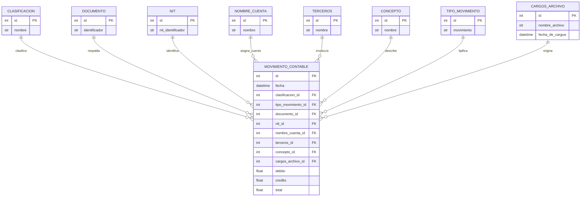

# Diagrama relacional — Movimiento contable

```mermaid
erDiagram
    CLASIFICACION {
        int id PK
        str nombre
    }
    DOCUMENTO {
        int id PK
        str identificador
    }
    NIT {
        int id PK
        str nit_identificador
    }
    NOMBRE_CUENTA {
        int id PK
        str nombre
    }
    TERCEROS {
        int id PK
        str nombre
    }
    CONCEPTO {
        int id PK
        str nombre
    }
    TIPO_MOVIMIENTO {
        int id PK
        str movimiento
    }
    CARGOS_ARCHIVO {
        int id PK
        str nombre_archivo
        datetime fecha_de_cargue
    }
    MOVIMIENTO_CONTABLE {
        int id PK
        datetime fecha 
        int clasificacion_id FK
        int tipo_movimiento_id FK
        int documento_id FK
        int nit_id FK
        int nombre_cuenta_id FK
        int terceros_id FK
        int concepto_id FK
        int cargos_archivo_id FK
        float debito
        float credito
        float total
    }

    CLASIFICACION    ||--o{ MOVIMIENTO_CONTABLE : "clasifica"
    DOCUMENTO        ||--o{ MOVIMIENTO_CONTABLE : "respalda"
    NIT              ||--o{ MOVIMIENTO_CONTABLE : "identifica"
    NOMBRE_CUENTA    ||--o{ MOVIMIENTO_CONTABLE : "asigna_cuenta"
    TERCEROS         ||--o{ MOVIMIENTO_CONTABLE : "involucra"
    CONCEPTO         ||--o{ MOVIMIENTO_CONTABLE : "describe"
    TIPO_MOVIMIENTO  ||--o{ MOVIMIENTO_CONTABLE : "tipifica"
    CARGOS_ARCHIVO   ||--o{ MOVIMIENTO_CONTABLE : "origina"
```

> Cada relación `||--o{` es **uno a muchos**: un registro de la tabla catálogo puede aparecer en muchos movimientos contables.
